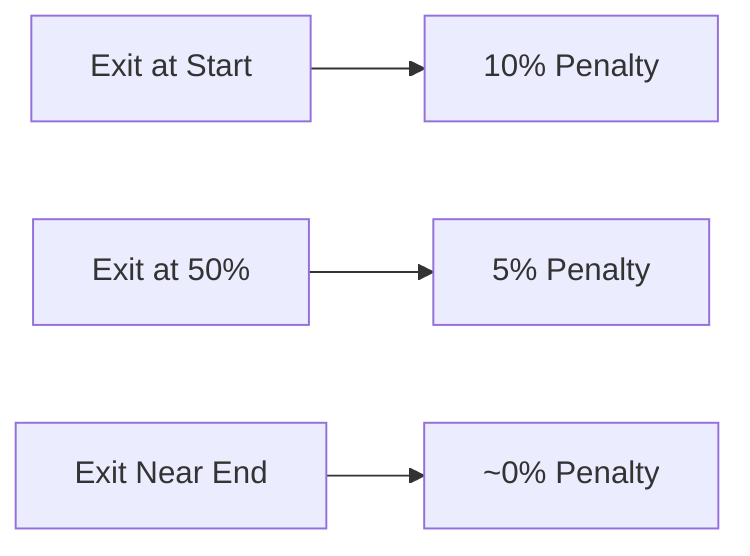

RBT Notes are fixed-term lockup instruments issued as **ERC-721 NFTs** that let holders earn **guaranteed yield** by committing their RBT for a set period. Unlike liquid staking where rewards vary and capital can leave at any time, Notes offer a simple proposition: lock now, know your exact return, collect at maturity.

## How Notes Work

<Steps>
  <Step title="Choose Term">
    Select your lockup duration (up to 52 weeks)
  </Step>
  <Step title="Deposit RBT">
    Lock your RBT into the Note contract
  </Step>
  <Step title="Receive NFT">
    Get an ERC-721 representing your position
  </Step>
  <Step title="Yield Locked">
    Your yield is calculated and locked from day one
  </Step>
  <Step title="Claim at Maturity">
    Burn the NFT and claim principal plus yield
  </Step>
</Steps>

<Note>
  Your yield is **guaranteed and known upfront**. No variable APYs or market dependencies.
</Note>

## Yield Curve

Yield scales with term length, combining a base yield with a bonus that accelerates for longer commitments:

```
Yield(t) = r_base × (t / t_max) + r_bonus × (t / t_max)²
```

| Parameter | Value |
|-----------|-------|
| t | Term length in weeks |
| t_max | 52 weeks |
| r_base | 19% |
| r_bonus | 33% |

### Sample Yields

| Term | Base Component | Bonus Component | Total Yield |
|------|----------------|-----------------|-------------|
| 13 weeks | 4.75% | 2.06% | ~6.81% |
| 26 weeks | 9.5% | 8.25% | ~17.75% |
| 39 weeks | 14.25% | 18.56% | ~32.81% |
| 52 weeks | 19% | 33% | **52%** |

<Tip>
  Longer terms earn disproportionately higher yields due to the quadratic bonus component.
</Tip>

## Early Exit

You can redeem before maturity, but it comes with **two costs**:

<Warning>
  Early exit forfeits ALL accrued yield and applies a principal penalty.
</Warning>

### Penalty Structure

| Cost | Description |
|------|-------------|
| **Forfeited Yield** | You receive zero yield regardless of time held |
| **Principal Penalty** | Up to 10% of deposit, scaling linearly with time remaining |

### Penalty Scaling

The penalty decreases proportionally with time held:



| Exit Timing | Principal Penalty |
|-------------|-------------------|
| Day 1 | 10% |
| 25% through | 7.5% |
| 50% through | 5% |
| 75% through | 2.5% |
| 99% through | ~0.1% |

<Info>
  Penalties flow back into the contract, funding future yields for holders who complete their terms.
</Info>

## Rewards Pool

<Warning>
  RBT Notes yield is funded by a **capped rewards pool**. When the pool is fully allocated, new Note deposits close until the pool refills.
</Warning>

Deposits reopen as rewards flow back into the pool. **First come, first serve.**

### Rewards Pool Inflows

<CardGroup cols={2}>
  <Card title="Excess Mints" icon="coins">
    From bond operations
  </Card>
  <Card title="Forfeited Yield" icon="ban">
    From early Note exits
  </Card>
  <Card title="Principal Penalties" icon="gavel">
    From early Note exits
  </Card>
  <Card title="Forfeited RBT" icon="xmark">
    From early bond redemptions
  </Card>
</CardGroup>

## Enhanced Bond Discounts

Active RBT Notes unlock **scaled bond discounts** based on term length and amount locked. The discount bonus applies automatically when purchasing bonds.

### Eligibility Requirements

| Requirement | Threshold |
|-------------|-----------|
| Note Term | > 12 weeks |
| RBT Amount | ≥ 1,000 RBT |

### Discount Calculation

```javascript
// Governance-adjustable thresholds
Min Threshold = 1,000 RBT
Max Threshold = 10,000 RBT
Maximum Bonus Discount = 2.5%

// Calculation
Term Factor = (Note Term - 12) / (52 - 12)
Amount Factor = min((RBT Amount - Min) / (Max - Min), 1)
Combined Factor = (Term Factor + Amount Factor) / 2
Bonus Discount = Combined Factor × Maximum Bonus

// Final discount
Final Bond Discount = Base Discount + Bonus Discount
```

### Bonus Examples

| Note Term | RBT Locked | Term Factor | Amount Factor | Bonus |
|-----------|------------|-------------|---------------|-------|
| 26 weeks | 5,000 RBT | 0.35 | 0.44 | ~1.0% |
| 39 weeks | 7,500 RBT | 0.675 | 0.72 | ~1.75% |
| 52 weeks | 10,000 RBT | 1.0 | 1.0 | **2.5%** |

<Note>
  Governance may adjust threshold parameters to maintain appropriate requirements as market conditions evolve.
</Note>

### Mathematical Formula

$$
D_{\text{final}} = D_{\text{base}} + \left[\frac{1}{2}\left(\frac{t - 12}{52 - 12} + \min\left(\frac{A - T_{\min}}{T_{\max} - T_{\min}}, 1\right)\right) \times B_{\max}\right]
$$

Where:
- **D_final** = Final bond discount
- **D_base** = Base discount from debt ratio
- **t** = Note term in weeks
- **A** = RBT amount locked in Note
- **T_min** = Minimum RBT threshold (1,000 RBT)
- **T_max** = Maximum RBT threshold (10,000 RBT)
- **B_max** = Maximum bonus discount (2.5%)

<Card title="Lock RBT" icon="lock" href="https://app.blackhaven.io/notes">
  Create an RBT Note position
</Card>
